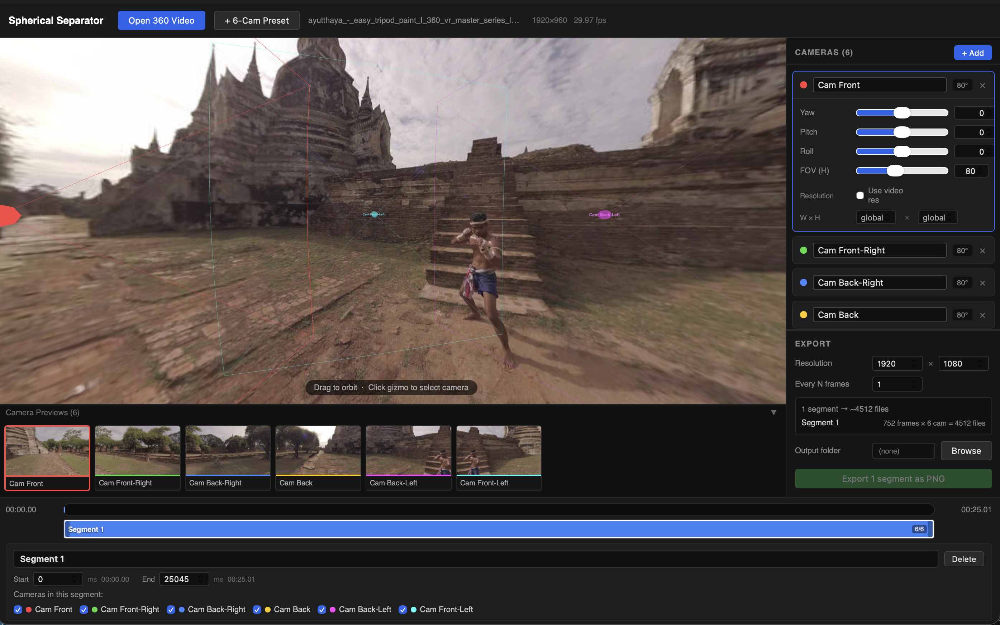

# Spherical Separator (Vibe Coded)

A desktop app for separating and previewing spherical (360°) video footage from multiple cameras. Built with React, Three.js, and Tauri.



## What it does

You load in spherical video files from multiple cameras, scrub through a timeline, preview each camera feed in a grid, and export the segments you want. The 3D viewport lets you see the footage mapped onto a sphere so you can get a feel for how it all fits together spatially.

## Stack

- **Tauri** — wraps the app as a native desktop binary (Rust backend, no Electron overhead)
- **React + TypeScript** — UI
- **Three.js** — 3D viewport for spherical preview
- **Vite** — build tooling

## Getting started

You'll need Rust and the Tauri CLI installed. If you haven't done that yet, follow the [Tauri prerequisites guide](https://tauri.app/start/prerequisites/).

Then:

```bash
npm install
npm run tauri:dev
```

That'll spin up the dev server and open the app window.

## Building

```bash
npm run tauri:build
```

The output will be in `src-tauri/target/release/bundle/`.

## Project structure

```
src/
  App.tsx             # root component, wires everything together
  Viewport3D.tsx      # Three.js spherical viewer
  CameraList.tsx      # sidebar list of loaded cameras
  CameraPreviewGrid.tsx  # grid of camera thumbnails
  Timeline.tsx        # scrubber / playback controls
  ExportPanel.tsx     # export settings and trigger
  types.ts            # shared TypeScript types
src-tauri/            # Rust/Tauri backend (file access, dialogs, etc.)
```

## Notes

- This is early-stage, version 0.0.0 — expect rough edges
- File access and dialogs go through Tauri plugins (`plugin-fs`, `plugin-dialog`) rather than the browser APIs
